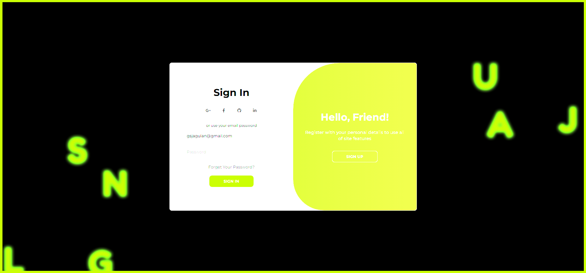

A sign in page that creates floating alphabets in random position inside the viewport when the user enters the email in both Sign and Sign up

This project is a modern login page with a visually engaging front-end interface. It features two forms—Sign In and Sign Up—togglable via buttons, styled with external CSS (assumed in style.css), and enhanced with JavaScript interactivity. Key elements include:

Structure (index.html):
Uses HTML5 with a clean, semantic layout (forms, social icons via Font Awesome, and toggle panels).
Links to external resources (Font Awesome, Google Fonts) for styling and typography.
Designed to be responsive with a meta viewport tag.
Functionality (script.js):
Form Toggling: Clicking “Sign Up” or “Sign In” buttons adds/removes an active class to switch between forms, showcasing DOM manipulation.
Scattered Alphabet Animation: Generates the alphabet (A-Z) as floating  elements with random positions and velocities, bouncing off window edges and avoiding overlap with the form container. Uses requestAnimationFrame for smooth animation.
Email Highlighting: Dynamically highlights matching alphabet letters as the user types an email, enhancing interactivity and UI feedback.
Purpose:
Likely a personal or portfolio project (credited to “AsmrProg”) to demonstrate front-end skills, creativity, and JavaScript proficiency.
While React isn’t explicitly used here, the component-like structure (e.g., reusable form logic) suggests adaptability to React, relevant to the Elysium Digital role.
Why It Fits the React Developer Role
React Potential: The modular form design and event handling align with React’s component-based approach—tweak this to say “built with React” if you refactor it.
Responsive Design: Meets the “building responsive websites” requirement.
UI/UX: The animation and highlighting show attention to user experience and detail.
Let me know if you’d like to adjust this further (e.g., assume React usage) or add it to your resume! Want a cover letter next?

